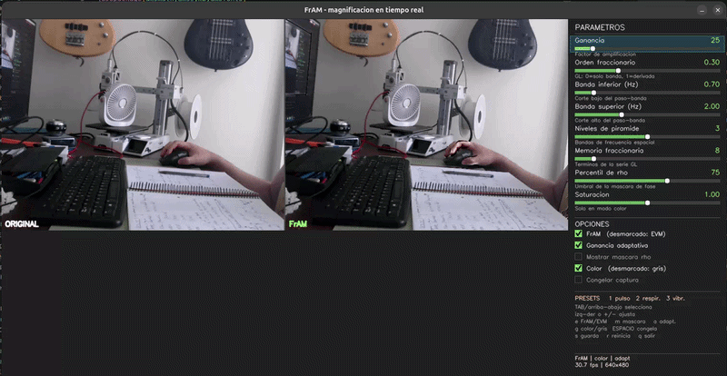
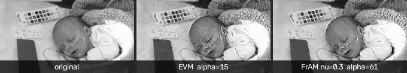
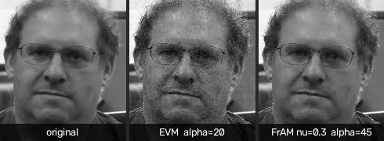
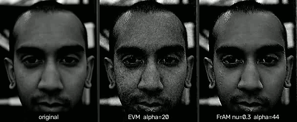

# FrAM — Fractional-order Adaptive Motion magnification

**TL;DR:** FrAM is an Eulerian method for sub-pixel video motion magnification. It replaces EVM’s temporal band-pass (Wu et al. 2012; reimplemented here as baseline) with a **Grünwald–Letnikov fractional derivative of order ν**

$$
Y_t = S_t + g \cdot D^\nu\,\mathrm{BP}[S_t]
$$

on a Laplacian pyramid (GL weights $w_k = w_{k-1}(k-1-\nu)/k$, truncated memory $K$, zero-phase Butterworth band-pass offline), and a **per-pixel gain from phase reliability**

$$
\rho=\frac{A^2}{A^2+\sigma^2},\qquad g=\alpha\cdot\frac{\rho}{1+\nu(1-\rho)}
$$

(monogenic/Riesz amplitude; no hand-tuned thresholds). A causal streaming engine matches the offline math for real time. On synthetic and MIT CSAIL clips (face, baby, subway), FrAM keeps flat-region noise near the input level where EVM roughly doubles it, with clearer spatial selectivity; **adaptive gain drives most of the noise win**, while **ν mainly trades amplification against noise**.







| Engine | Module | Use it for |
|---|---|---|
| **Real time** | `fracmag_rt.py` | live viewer, online processing |
| Offline | `fracmag.py` | paper figures (zero-phase filter) |

Details and equations: [preprint](https://arxiv.org/abs/2609.04502). This README is how to run it.

## Offline vs real time

Offline refilters the whole buffer with `filtfilt` and keeps only the last frame — expensive, but not because of fractional calculus. The real-time path uses the same operators in causal form: recursive band-pass, circular buffer for the GL sum, EMA reliability mask, float32. One deliberate difference: Sobel (with transverse smoothing) instead of offline Riesz, because the causal mask is instantaneous and needs extra regularisation. See **Appendix A** of the preprint.

---

## Installation

```bash
python3 -m venv --system-site-packages .venv
source .venv/bin/activate
pip install -r requirements.txt
```

`--system-site-packages` exposes system **tkinter** (Debian/Ubuntu). Needed only for `live_fram_tk.py`:

```bash
sudo apt install python3-tk
```

The OpenCV viewer (`live_fram.py`) needs no tkinter. No `pyrtools`, PyTorch, or GPU.

---

## 1. Real-time webcam demo

```bash
python3 live_fram.py
```

One window: original | FrAM | hand-drawn parameter panel (full names + descriptions). Mouse or keyboard.

```bash
python3 live_fram.py --camera 2
python3 live_fram.py --gray
python3 live_fram.py --width 320
python3 live_fram.py --video path/to/face.mp4
```

| Option | Default | Effect |
|---|---|---|
| `--camera N` | `0` | `/dev/videoN` |
| `--video PATH` | — | loop a file |
| `--width N` | native | limit processing width |
| `--gray` | color | start grayscale |
| `--fps F` | auto | force sampling rate |

**Panel:** Gain (α), Fractional order (ν), band (Hz), pyramid levels, GL memory $K$, ρ percentile, saturation. Checkboxes: FrAM/EVM, adaptive gain, ρ mask, color/gray, freeze.

| Key | Action |
|---|---|
| `TAB` · arrows · `+` `-` | select / adjust |
| `e` / `a` / `m` / `g` | FrAM↔EVM / adaptive / ρ mask / color↔gray |
| `1` `2` `3` | pulse · breathing · vibration |
| `s` `r` `SPACE` `q` | save · reset · freeze · quit |

Don’t resize the window if you can avoid it (mouse maps 1:1); keyboard always works.

**What to try:** `a` (adaptive ablation), `m` (ρ on edges / dark on flats), `e` (vs EVM), lower $K$ and watch fps.

| Target | band (Hz) | α | ν | levels | Preset |
|---|---|---|---|---|---|
| Facial pulse | 0.7–2.0 | 25–50 | 0.2–0.3 | 3 | `1` |
| Breathing | 0.2–0.8 | 15–30 | 0.2 | 3–4 | `2` |
| Vibration | 1.0–5.0 | 10–25 | 0.3 | 3 | `3` |

Real-time is causal: group delay, ~40-frame warm-up, slightly noisier mask than offline. Published figures use offline mode.

---

## 2. Reproducible experiments

```bash
python3 experiments.py        # synthetic GT → results.md, figs 1–3
python3 fetch_videos.py       # MIT CSAIL clips → assets/source/
python3 real_video.py         # real video → results_real.md, fig 4
python3 export_videos.py      # side-by-side MP4s in assets/
python3 experiments_rt.py     # streaming engine → results_rt.md, fig 5
```

Synthetic: known sub-pixel displacement (textured + flat halves) so amplification is measurable. Real clips: physiological selectivity, flat-region noise, spatial selectivity — FrAM reduces background noise and improves selectivity across the set; the margin size is not predicted by input contrast alone.

---

## 3. Library use

**Real time (recommended):**

```python
import fracmag_rt as rt

engine = rt.FrAMStream(fps=30.0, f_lo=0.7, f_hi=2.0,
                       alpha=25.0, nu=0.3, levels=3,
                       adaptive=True, K_max=8)
for frame in sequence:             # (H, W) float32 in [0,1]
    out = engine.push(frame)

engine_c = rt.FrAMStreamColor(fps=30.0, f_lo=0.7, f_hi=2.0, nu=0.3, chroma=1.0)
out_bgr = engine_c.push(frame_bgr)
engine.set_params(alpha=40.0, adaptive=False)
```

**Offline** (zero phase, paper figures):

```python
import fracmag as fm

out = fm.fram_magnify(frames, fps=30.0, f_lo=0.7, f_hi=2.0,
                      alpha=20.0, nu=0.3, levels=4, adaptive=True)
base = fm.evm_magnify(frames, 30.0, 0.7, 2.0, alpha=20.0, levels=4)
```

Main entry points: `FrAMStream` / `FrAMStreamColor`, `fram_magnify` / `evm_magnify`, plus GL helpers, ρ / adaptive gain, and Laplacian pyramid utilities.

```python
>>> fm.gl_coefficients(1.0, 4)   # backward difference
>>> fm.gl_coefficients(2.0, 4)   # second difference
```

---

## 4. Troubleshooting

| Issue | Fix |
|---|---|
| No `tkinter` | `sudo apt install python3-tk`, or use `live_fram.py` |
| Qt / Wayland | `QT_QPA_PLATFORM=xcb python3 live_fram.py` |
| No webcam | probe indices with OpenCV; try `--camera N` |
| Slow (~0.5 fps) | you’re on offline `fracmag`; use `fracmag_rt` / live viewer |
| First seconds wrong | causal warm-up (~40 frames) |
| No visible effect | raise α, match the band, keep ν ≲ 0.5 |

---

## Files

| File | Role |
|---|---|
| `fracmag.py` / `fracmag_rt.py` | offline core · causal streaming |
| `live_fram.py` / `live_fram_tk.py` | OpenCV / Tk viewers |
| `experiments*.py`, `real_video.py`, `export_videos.py` | tables & figures |
| `fetch_videos.py`, `benchmark.py` | clips · synthetic GT |
| `paper/fram.tex`, `assets/` | preprint · media |
